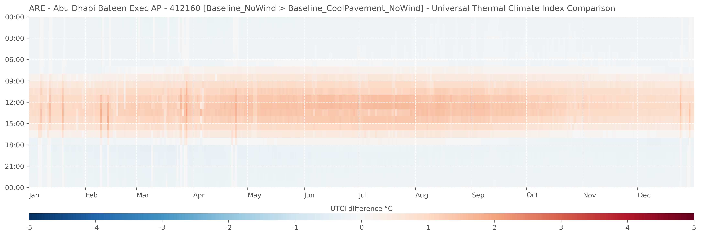

# Openfield MRT & UTCI

This method of calculating the open-field MRT uses the SolarCal module of Ladybug, in conjunction with annual radiation simulation using Radiance. Radiation from the sun, reflected radiation from the ground and diffuse radiation from the sky are combined to create an effective radiant field, then converted into an MRT delta which is added to an MRT for surrounding surface temperature (in an open field this long-wave MRT is surface temperature of the ground.) 

Full documentation for this method is available from https://www.ladybug.tools/ladybug-comfort/docs/_modules/ladybug_comfort/solarcal.html.

## Installation and setup
A few packages and external programs are required here to get this code running. 

### External programs
- Radiance - https://github.com/NREL/Radiance/releases/latest
- EnergyPlus - https://github.com/NREL/OpenStudio/releases/latest

### Python
- Python packages required are listed in the `requirements.txt` file. Most of them you'll already have on your machine, but for those you don't, try running the following command to install them:

`pip install -r "./requirements.txt"`

After that, you should be ready to start generating some funky looking charts!

